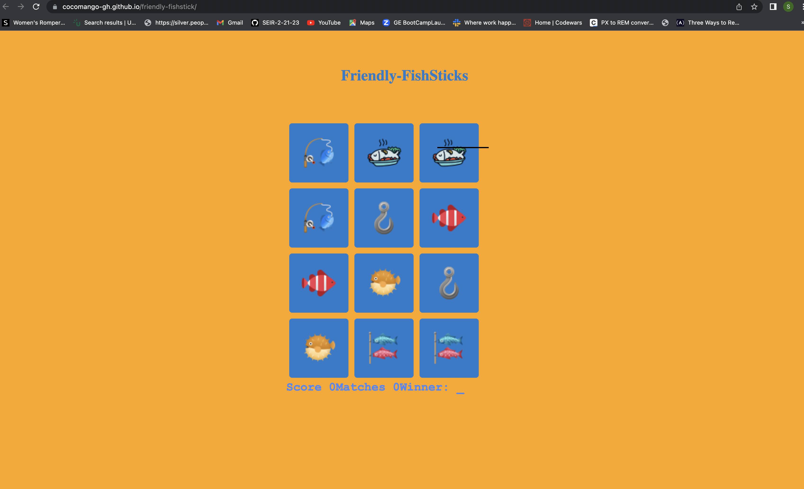
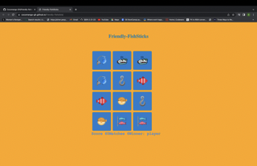

# Friendly-Fishsticks 
:tropical_fish: **Welcome to the game of Friendly-FishSticks a concentration game can you help the friend find their twin?** :tropical_fish:

###*Rules of the game* 
**Player must find 6 matches to win the game for every correct match player gets 10 points. If player gets incorrect matches 2 points will be subtracted from score three incorrect macthes the game will be over.**

**technologies**

   

   


###[Demo Link](https://cocomango-gh.github.io/friendly-fishstick/)


####Future Plans for Frinedly Fish-sticks
- add reset button
- flip cards feature 
- countdown 
- moves made feature 
- make the game more interactive for users 
- add play button 

####code that chanllenge me
```js
// this line removes flipped from the second element in the array the second line subtracts two from the score and the three line turns the flipped array back to empty so we can pick of the cards for  matches.
//this was my biggest challenge and getting the matching to work. 
 flipped[0].classList.remove('flipped');
        flipped[1].classList.remove('flipped');
        score -= 2;
        flipped = [];
```

**Code-Refrences-used** 
[github](https://marina-ferreira.github.io/tutorials/js/memory-game/)